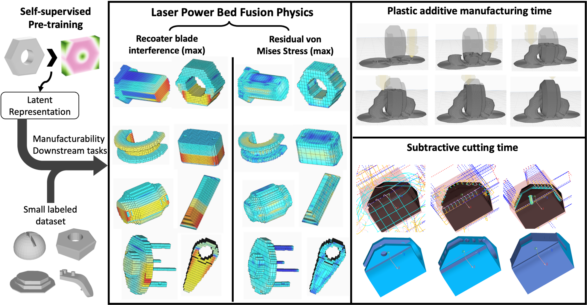

<!DOCTYPE html>
<html>
<head>
</head>
<body>
<h1>VIRL: Volume-Informed Representation Learning towards Few-shot Manufacturability Estimation</h1>

<h4><a href="https://arxiv.org/abs/2406.12286v1">[Paper]</a></h4>

<h2>Project summary</h2>

Estimating manufacturability via CAM simulation is important yet time consuming. We propose a self-supervised learning technique to pretrain a foundation model from pure geometry information using a large CAD repository.Through experiments, this model has shown success adapting to various downstream manufacturability labels with only a limited number of simulations.

<h3>System requirements</h3>

The project runs on Linux. Required (Python) packages can be found in requirements.txt. Note that this project has dependencies of <a href="https://github.com/deGravity/automate">[Automate]</a> and <a href="https://github.com/deGravity/hybridbrep">[Hybrid BRep].</a>

<h2>Pretraining</h2>

VIRL leverages insights from practical considerations: subtractive machining involves progressively removing all accessible and unwanted materials from a starting block to create the target part, while additive manufacturing requires the injection head or laser to traverse through every point of the part for infilling. Therefore, equipping the encoder with volumetric data during pre-training is intuitively advantageous for executing such spatial planning tasks. 

<h3>code</h3>

To run the pretraining code, locate the BRep graph (<a href="https://cmu.box.com/s/q8acaeisz86u16s6mbca0spg3idvyojk">[simple_processed]</a>), SDF (<a href="https://cmu.box.com/s/nhm1a7hrw41jvxx1ny1o3tgu83f5cah0">[sdf_40]</a>), and the extracted height, width, length (<a href="https://cmu.box.com/s/7mxd41nwc2p6pxqomu97bn0246yfk938">[range]</a>).

Then, run the pretrainig code as follows:

<pre><code>python pretrain.py --yaml pretrain.yaml</code></pre>

If you wish to use the pretrained model directly, it can be downloaded <a href="https://cmu.box.com/s/z6epaqddi81frp932zfcm9aav1arsa1d">[here]</a>.

<h2>Simulations (Manufacturability Label Generation)</h2>

We chose 4 different mannufacturability tasks, spanning from plastic to metallic, subtractive machining to additive manufacturing, time estimation to structural physics quantites, in attempt to showcase our foundation model can be applied on wide range of manufacturability applications.

Among all, we feel the neccessity to explain how the CNC machining simulation is being setup, due to its complexity. Firstly, the optimal setup orientation is determined by assessing trapped volume along all six axes. The axis with the least inaccessibility is chosen as the initial cutting orientation, followed by cutting from remaining five axes if the part needs further subtraction from the stock. Additionally, three sequential tool bits are employed to cut the stock, each progressively smaller to simulate roughing, semi-finishing, and finishing processes. As a result, the cutting procedure could potentially involve up to 18 processes in total.

In this repo, we only upload the single manufacturability label for each task, namely: max residual stress, max blade interference percentage, total additive printing time, and total CNC machining time. If you have need for the full CAM simulation results, please email yuhsuan2 [at] andrew [dot] cmu [dot] edu
The data distribution is as follows:

<h3>data</h3>

The four manufacturability data on the Fusion360 segmentation dataset can be found <a href="https://cmu.box.com/s/dlshmcn8o2wj63tldz01v5ola5vg8mdc">[here]</a>.
In each folder, the zip file corresponds to the manufacturability labels generated by simulation, and the json file has done the train/val/test split of the dataset.
Not that not all train data is necessarrily used in the manufacturability estimation. We only take a selected number of samples (shots) for each experiment.

<h2>Downstream Results</h2>

Post pretraining, the decoder is discarded, and the encoder’s latent code layer is extended with two additional linear layers tasked with the downstream manufacturability labels. We have benchmarked each model using probing and funetuning, as the following figure:

The figures reveal performance of VIRl’s pretrained model vs the state of the art surface rendering and UV net, across 4 case studies with varying number of training labels from 50 to 10000. X axis is number of simulation labels (shots) given, y axis is the test R2 score.

<h3>code</h3>

To run the code, make sure you download the <a href="https://cmu.box.com/s/dlshmcn8o2wj63tldz01v5ola5vg8mdc">[manufacturability labels]</a> first, and also have the <a href="https://cmu.box.com/s/q8acaeisz86u16s6mbca0spg3idvyojk">[BRep files]</a> available.
Next run this:

<pre><code>python few_shot_exp.py --yaml config/few_shot_print_time.yaml</code></pre>

<pre><code>python few_shot_exp.py --yaml config/few_shot_cnc.yaml</code></pre>

<pre><code>python few_shot_exp.py --yaml config/few_shot_recoat.yaml</code></pre>

<pre><code>python few_shot_exp.py --yaml config/few_shot_stress.yaml</code></pre>

Key control terms:  regress_tdi: whether to include task dependent input  label_root: manufacturability 
    label directory  partial: None to exclude LoRA finetuning  rank: If using LoRA, rank number  pre_path: pretrained model path 
     range_log: whether to apply log on manufacturability labels  norm_const: whether to multiply labels by a constant 
     range_root: input to calculate TDI  regress_norm: True for dynamic norm, False for static norm  seed: shot selection randomness
     shots: number of training labels \splits: The train/val/test split for manufacturability downstream tasks. Because each simulation has
    a few failures, we create separate splitting json files for each manufacturability case study.

We have implemented task dependent input for two case studies.

1. CNC machining time, TDI is subtracted volume, and it can be downloaded <a href="https://cmu.box.com/s/pn311ogiqhc8wybpjxollcghnipzv96s">[here]</a>.

2. 3D printing time. TDI is the regression model with volume, area and height as input, and it can be downloaded <a href="https://cmu.box.com/s/94eoxuqdz4xvwof7sfgtl44614tqcmc2">[here]</a>.

<h3>tSNE Visualization</h3>

Code for generating latent vectors from a pretrained model and its 2D tSNE visualization can be found in the notebook dimension_reduction.ipynb.

For any questions implementing, feel free to email Sean Chen as <b>yuhsuan2[at]andrew[dot]cmu[dot]edu</b>

</body>
</html>